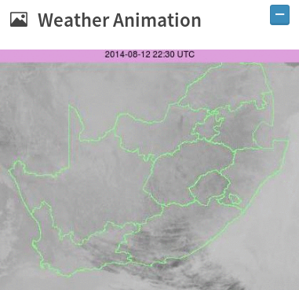

# Fynbos Fire Dashboard

## User Guide

### Disclaimer
?????????????????????????????????????????????????????????
<CSIR disclaimer>

Copyright © 2014 CSIR

### Preface

Thank you for choosing AFIS products! This user manual provides detailed instructions of using the AFIS Fire Dashboard. Please read carefully and start to enjoy the powerful functions of our program!

This manual provides the description of all the functions of the Fire Dashboard. The product you purchased will receive data specific to your company’s needs.

?????????????????????????????????????????????????????????

### Content
?????????????????????????????????????????????????????????

### Features & How-To

#### Active Fires Table

The Active Fires widget can be used to find information about active fires in your region. The widget allows you to view ownership information for properties when a fire is detected on a property. Fires can be sorted and filtered based on specific criteria.

#### View Fire Information

Select an active fire

1. Click on fire in table
2. OR: Search (if user knows location name)
3. View information in the table

View property information for a fire

1. Select fire.
2. Click on the   
button in the table.

Change fire name

1. Select fire.
2. Click on the  button in the table.
3. Type a new name.

Dort the fires according to some attribute

1. Click on the sorting field in the table header.

2. Toggle sorting between ascending (A..Z) and descending (Z..A).

Filter the list to see the fires for a time frame

1. Click on the  button in the table.
2. Select a time frame.
3. Observe change in count on light blue label.

#### Active Fire Map

The Active Fire Map widget can be used to view active fires on a map. You can zoom in and out on the map and also zoom to a specific area. Four Google Maps layer are available to toggle between.

Switch between different Google Layers

* Select layer by clicking on the layer button you want to load.

Select an active fire

* Click on the active fire on the map.

Zoom in on map

* Click on the  button.

Zoom out on map

* Click on the  button.

Pan on map

* Click on any location on map and drag to location.

Zoom to area

* Click on map and drag while pressing ‘Shift’.

#### Graphs

The Graphs widget can be used to view timeline information about fire danger index, temperature, wind speed, rainfall and humidity from different weather stations. 

View Fire Danger Index graph

* Click on the Fire Danger Index  button.

View Temperature graph

* Click on the Temperature  button.

View Wind Speed graph

* Click on the Wind Speed  button.

View Rainfall graph

* Click on the Rainfall  button.

View Humidity graph

* Click on Humidity  button.

Change weather station

1. Click on weather station (name) dropdown.

2. Select the weather station.

Check value for point along graph

* Hover mouse over the point.

#### Weather Animation

The Weather Animation widget can be used to view an animation of recent weather conditions.

View weather animation

* No interaction.

#### My FDI Locations

The My FDI Locations widget can be used to view 

View data for an FDI location

* Click on the  button to expand the view.

Add a FDI location

1. Click on the  button.
2. Add a description in the description field.
3. Add a latitude in the latitude field.
4. Add a longitude in the longitude field.
5. OR: Click on the location on the map.
6. Click on Add Location.

Remove a FDI location

* Click on the  button.

#### 5 Day Forecast
    

View the forecast for a specific day

* Click on the button on the left (or hover over day title).

Change the forecast location

1. Click on the location dropdown.

2. Click on the location name.

Add a forecast location

1. Click on the  button.
2. Add a description in the description field.
3. Add a latitude in the latitude field.
4. Add a longitude in the longitude field.
5. OR: Click on the location on the map.
6. Click on Add Location.

Remove location

* Click on the  button.

#### Reports

View a report

* Click on the report title on calender view.

Request a report

1. Click on Request Report button.

2. Type a report name.
3. Choose a report type.
4. Select a date range.
5. Click on Request Report

hello

Change the month viewed

* Click on the  buttons.

#### Requested Reports

View a report

* Click on the report title.

Remove a report

* Click on the  button.

#### Monthly Reports

View a monthly report

* Click on the report title.

